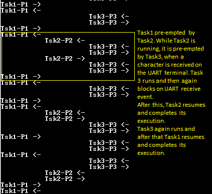
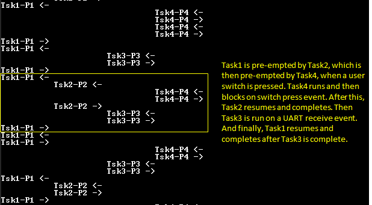

## FreeRTOS basic

This example application demonstrates context switching between four tasks of different priorites. Two tasks run periodically while the other two tasks are event driven.

## Description

This demonstration creates four tasks each of differen priority. Task1 has the lowest priority, followed by Task2, Task3 and Task4 which has the highest priority. Task1 and Task2 run periodically. 

Task3 blocks until a character is received on UART terminal. Task3 registers a read callback with the UART PLIB and blcoks on a UART receive semaphore. The semaphore is given from the registered callback which is called when a character is receved on the terminal. 

Task4 blocks until a user switch is pressed. Task4 registers a callback for the switch press event with the PIO peripheral and then blocks on the switch press semaphore. The semaphore is given from the registered callback which is called when the switch is pressed.

All the tasks print messages on the UART terminal to indicate tasks entry/exit. Since all the tasks use the same UART peripheral library, a mutex is used to guard the shared resource (UART ring buffer).

- **Task1**: Task1 is configured for priority 1 (lowest of all the application tasks). The task1 runs for about 100 ticks and then blocks for 10 milliseconds. Each time task1 is run, it prints a message on the UART console "Tsk1-P1 <-" where, the <- symbol indicates that task1 is running. Just before blocking it prints another message on the UART console "Tsk1-P1 ->" where, the -> symbol indicates that task1 is about to put itself into a blocked state.
- **Task2**: Task2 is configured for priority 2. The task2 runs for about 10 ticks and then blocks for 250 milliseconds. Each time task2 is run, it prints a message on the UART console "Tsk2-P2 <-" where, the <- symbol indicates that task2 is running. Just before blocking it prints another message on the UART console "Tsk2-P2 ->" where, the -> symbol indicates that task2 is about to put itself into a blocked state.
- **Task3**: Task3 is configured for priority 3. It remains blocked on a semaphore which is released when a character is entered on the UART console. Once active, the task reads out the received characters and toggles LED if letter 'L' or 'l' is pressed. The task then runs for about 50 ticks, before again blocking itself until a new character is received. Each time task3 is run, it prints a message on the UART console "Tsk3-P3 <-" where, the <- symbol indicates that task2 is running. Just before blocking it prints another message on the UART console "Tsk3-P3 ->" where, the -> symbol indicates that task3 is about to put itself into a blocked state.
- **Task4**: Task4 is configured for priority 4 (highest of all the application tasks). It remains blocked on a semaphore which is released when a user switch is pressed. Once active, the task runs for about 10 ticks, before again blocking itself until the switch is pressed again. Each time task4 is run, it prints a message on the UART console "Tsk4-P4 <-" where, the <- symbol indicates that task4 is running. Just before blocking it prints another message on the UART console "Tsk4-P4 ->" where, the -> symbol indicates that task4 is about to put itself into a blocked state.

The following figure shows possible context switching between the tasks.

   

## Downloading and building the application

To clone or download this application from Github, go to the [main page of this repository](https://github.com/Microchip-MPLAB-Harmony/core_apps_sam_d21_da1) and then click Clone button to clone this repository or download as zip file.
This content can also be downloaded using content manager by following these [instructions](https://github.com/Microchip-MPLAB-Harmony/contentmanager/wiki).

Path of the application within the repository is **apps/rtos/freertos/basic_freertos/firmware** .

To build the application, refer to the following table and open the project using its IDE.

| Project Name      | Description                                    |
| ----------------- | ---------------------------------------------- |
| sam_d21_xpro.X | MPLABX project for [SAM D21 Xplained Pro Evaluation Kit](https://www.microchip.com/developmenttools/ProductDetails/atsamd21-xpro) |
| sam_da1_xpro.X | MPLABX project for [SAM DA1 Xplained Pro Evaluation Kit](https://www.microchip.com/DevelopmentTools/ProductDetails/PartNO/ATSAMDA1-XPRO) |
|||

## Setting up the hardware

The following table shows the target hardware for the application projects.

| Project Name| Board|
|:---------|:---------:|
| sam_d21_xpro.X | [SAM D21 Xplained Pro Evaluation Kit](https://www.microchip.com/developmenttools/ProductDetails/atsamd21-xpro) |
| sam_da1_xpro.X | [SAM DA1 Xplained Pro Evaluation Kit](https://www.microchip.com/DevelopmentTools/ProductDetails/PartNO/ATSAMDA1-XPRO) |
|||

### Setting up [SAM D21 Xplained Pro Evaluation Kit](https://www.microchip.com/developmenttools/ProductDetails/atsamd21-xpro)

- Connect the Debug USB port on the board to the computer using a micro USB cable

### Setting up [SAM DA1 Xplained Pro Evaluation Kit](https://www.microchip.com/DevelopmentTools/ProductDetails/PartNO/ATSAMDA1-XPRO)

- Connect the Debug USB port on the board to the computer using a micro USB cable

## Running the Application

1. Open the Terminal application (Ex.:Tera Term) on the computer.
2. Connect to the EDBG Virtual COM port and configure the serial settings as follows:

    Baud : 115200

    Data : 8 Bits
    
    Parity : None
    
    Stop : 1 Bit
    
    Flow Control : None
3. Build and program the application using its IDE.
4. Observe the following output on the terminal.

   

5. Enter any character on the terminal to run task3. Notice how task1 and task2 are pre-empted by task3 as task3 is of higher priority than task1 and task2. Pressing character 'l' or "L' toggles the on board LED. Notice how task1 and task2 are not run when characters are entered continuously on the terminal.

   

   

6. Press the user switch on the board to run task4. Notice how task4 preempts all other tasks as it is of highest priority.

   

Refer to the following table for LED and Switch name:

| Board | LED Name | Switch Name |
| ----- | -------- | -------- |
|  [SAM D21 Xplained Pro Evaluation Kit](https://www.microchip.com/developmenttools/ProductDetails/atsamd21-xpro) | LED0 | SW0 |
|  [SAM DA1 Xplained Pro Evaluation Kit](https://www.microchip.com/DevelopmentTools/ProductDetails/PartNO/ATSAMDA1-XPRO) | LED0 | SW0 |
|||
